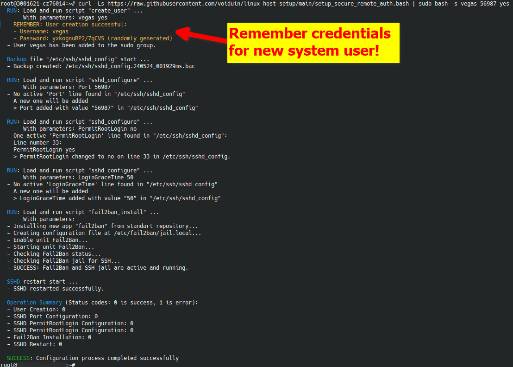

# Secure Remote Authentication Setup Scripts Suite
This repository contains a collection of scripts designed to enhance the security of remote authentication systems on Linux servers.
The primary script, [`setup_secure_remote_auth.bash`](setup_secure_remote_auth.bash), integrates functionalities from three other utility scripts to establish a robust and secure remote authentication environment. Each script can also be executed independently depending on specific needs.

## Example: Configuring Secure SSH with Script

This example demonstrates how to use the [`setup_secure_remote_auth.bash`](setup_secure_remote_auth.bash) script to perform the following actions:
1. Create a new user named **"testuser"**
2. Change the SSH port to a non-standard port **"2222"**
3. Install **"fail2ban"** with standard settings (not configurable in this script)
4. Require a restart of the SSH server **"sshd"** to apply the new setting.\
By default, these changes are made, but in the end, the user must manually restart the SSH server:
   - Change the port number to (**Port ${new_sshd_port}**)
   - Disable root login (**PermitRootLogin no**)
   - Reduce the time for unauthorized sessions (**LoginGraceTime 50**)

Example terminal command (tested on Ubuntu 22.04):
```bash
$ export RSCRIPT_BASE_URL='https://raw.githubusercontent.com/voiduin/linux-host-setup/main' &&\
  curl -Ls "${RSCRIPT_BASE_URL}/setup_secure_remote_auth.bash" | sudo bash -s testuser 2222 --restart-sshd
```

## Scripts Overview

1. **setup_secure_remote_auth.bash** - This master script configures the entire secure remote authentication setup, utilizing the other three scripts listed below to perform specific tasks.
2. **fail2ban_install.bash** - Installs and configures Fail2Ban to protect SSH access.
3. **sshd_configure.bash** - Configures various SSHD settings like port, root login permission, and password authentication.
4. **create_user.bash** - Creates a new user with an optional password; if no password is specified, a random one will be generated.

### 1. `setup_secure_remote_auth.bash`

This script is the main orchestrator that sets up secure remote authentication by configuring SSH settings, installing and configuring Fail2Ban, and managing user creation with enhanced security protocols.

#### Features:
- Modifies SSH configuration to secure settings.
- Installs and configures Fail2Ban to protect SSH.
- Provides the capability to add a new user with secure parameters.

#### Usage:
```bash
curl -Ls https://raw.githubusercontent.com/voiduin/linux-host-setup/main/setup_secure_remote_auth.bash | sudo bash -s [new_username] [new_sshd_port] [--restart-sshd]
```
or
```bash
wget -qO - https://raw.githubusercontent.com/voiduin/linux-host-setup/main/setup_secure_remote_auth.bash | sudo bash -s [new_username] [new_sshd_port] [--restart-sshd]
```

Example output below:
<p align="center">
    
</p>

### 2. `fail2ban_install.bash`

Installs and configures Fail2Ban to enhance the security of the server by monitoring log files and banning IPs that show malicious signs.

#### Features:
- Automatically installs Fail2Ban.
- Configures Fail2Ban to protect SSH access.

#### Usage:
```bash
$ SCRIPT_URL='https://raw.githubusercontent.com/voiduin/linux-host-setup/main/fail2ban_install.bash';\
curl -Ls "${SCRIPT_URL}" | sudo bash -s
```
or
```bash
$ SCRIPT_URL='https://raw.githubusercontent.com/voiduin/linux-host-setup/main/fail2ban_install.bash';\
wget -qO - "${SCRIPT_URL}" | sudo bash -s
```

### 3. `sshd_configure.bash`

Modifies SSHD configuration settings securely to apply best security practices like changing the default port, disabling root login, and enforcing key-based authentication.

#### Features:
- Can change any SSHD configuration parameter.
- Validates changes to avoid common configuration errors.

#### Usage:
```bash
$ SCRIPT_URL='https://raw.githubusercontent.com/voiduin/linux-host-setup/main/sshd_configure.bash';\
curl -Ls "${SCRIPT_URL}" | sudo bash -s [setting_name] [value]
```
or
```bash
$ SCRIPT_URL='https://raw.githubusercontent.com/voiduin/linux-host-setup/main/sshd_configure.bash';\
wget -qO - "${SCRIPT_URL}" | sudo bash -s [setting_name] [value]
```

### 4. `create_user.bash`

Handles the creation of new users with an option to set a secure password or generate a random one.

After running the command, you will receive the following output, which includes a new, randomly generated password that you can change later:
```bash
$ ./create_user.bash new_username
User creation successful:
  - Username: new_username
  - Password: xhG71Ct94Vth4j7M (randomly generated)
```

#### Features:
- Creates a new user with a specified or random password.
- Ensures that the user does not already exist.

#### Usage:
```bash
$ SCRIPT_URL='https://raw.githubusercontent.com/voiduin/linux-host-setup/main/create_user.bash';\
curl -Ls "${SCRIPT_URL}" | sudo bash -s username [--add-to-sudo] [password]
```
or
```bash
$ SCRIPT_URL='https://raw.githubusercontent.com/voiduin/linux-host-setup/main/create_user.bash';\
wget -qO - "${SCRIPT_URL}" | sudo bash -s username [--add-to-sudo] [password]
```

## General Instructions

Each script can be run directly from the command line interface (CLI) or executed remotely via `curl` or `wget`. It is highly recommended to review the help section of each script (`show_usage` function within each script) for detailed information on the parameters and the expected behavior.

For security and functionality, ensure that you run these scripts with root privileges. Each script contains error handling to guide you through proper usage and to prevent common mistakes.

## Contributing

Contributions to improve the scripts or documentation are welcome. Please refer to the project's GitHub page to submit issues or pull requests.

## License

This project is licensed under the MIT License - see the [LICENSE.md](LICENSE.md) file for details.
